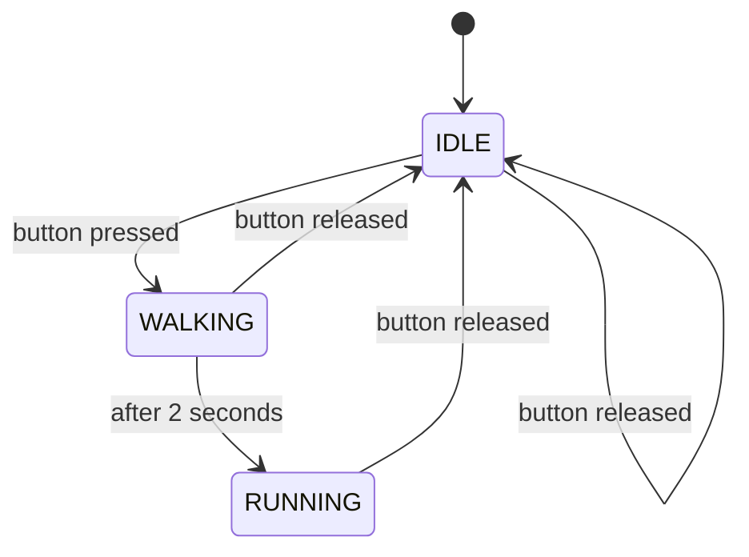

javascript-button-timer
==

## Usage

```sh
make
```

## Diagram



## Demo

* Hold the button down
* Notice at first that the player state is "WALKING"
* If you hold the button, the player state will eventually switch to "RUNNING"
* When you release the button the player state will return to "IDLE"

* * *

## Original ChatGTP transcript

### Prompt

write up in html and javascript how to detect if a button has been held for more than two seconds and when that threshold is reached, change a state

### ChatGTP response

Creating a simple HTML and JavaScript solution to detect if a button has been held for more than two seconds involves starting a timer when the button is pressed (mousedown event) and clearing that timer if the button is released (mouseup or mouseleave event) before the 2-second threshold is reached. If the threshold is reached, we change a specified state. Below is an example that demonstrates this functionality, changing the text of a paragraph as the state change when the button is held for more than two seconds.

```html
<!DOCTYPE html>
<html lang="en">
<head>
<meta charset="UTF-8">
<meta name="viewport" content="width=device-width, initial-scale=1.0">
<title>Button Hold Detector</title>
<script>
  let holdTimer;
  const threshold = 2000; // 2 seconds

  function startTimer() {
    // Clears any existing timer to avoid multiple triggers
    clearTimeout(holdTimer);
    // Sets a timer to change the state after 2 seconds
    holdTimer = setTimeout(changeState, threshold);
  }

  function clearTimer() {
    // Clears the timer if the button is released before 2 seconds
    clearTimeout(holdTimer);
  }

  function changeState() {
    // Changes the state; for demonstration, changing the text of a paragraph
    document.getElementById("statusText").textContent = "Button was held for more than 2 seconds!";
  }
</script>
</head>
<body>
<h2>Hold the Button Test</h2>
<button id="holdButton" onmousedown="startTimer()" onmouseup="clearTimer()" onmouseleave="clearTimer()">Hold Me</button>
<p id="statusText">Hold the button for more than 2 seconds to change this text.</p>
</body>
</html>
```

### Explanation:

1. **HTML Structure**: There's a button that users can press and hold, and a paragraph (`<p>`) element where the state change will be displayed.
2. **JavaScript Logic**:
    - `startTimer()`: Initiates a timer when the button is pressed. If the button is held down for more than 2 seconds, the `changeState()` function is called.
    - `clearTimer()`: Clears the timer if the button is released before reaching the 2-second threshold, preventing the state change.
    - `changeState()`: Contains the logic for changing the state. In this example, it changes the text content of a paragraph, but you can modify it to perform any action, like changing a variable's value or updating a user interface element.
3. **Event Handlers**:
    - `onmousedown` triggers when the button is pressed, starting the timer.
    - `onmouseup` and `onmouseleave` ensure the timer is cleared if the button is released or the cursor leaves the button area before the time threshold is met, preventing accidental state changes.

* * *

## State Diagram

### Prompt

write a Mermaid JS diagram to show a state diagram that has a player state that can transition from IDLE when a button is pused, to WALKING to RUNNING (after a threshold of 2 seconds is met) and back to IDLE when the button is released

### ChatGPT response

To create a state diagram in Mermaid JS that describes the transition of a player's state from IDLE to WALKING, then to RUNNING (after a threshold of 2 seconds is met), and back to IDLE when a button is released, you can use the following code:


Here's a breakdown of what this diagram represents:
- The player starts in the `IDLE` state.
- When a button is pressed, the player transitions from `IDLE` to `WALKING`.
- If the button is continuously pressed and a threshold of 2 seconds is met, the state transitions from `WALKING` to `RUNNING`.
- Releasing the button at any point transitions the player back to `IDLE` from either `WALKING` or `RUNNING`.
- Additionally, if the button is released while in the `IDLE` state, the player remains in the `IDLE` state, which is an implicit transition showing the state doesn't change upon this action when already idle.

This Mermaid JS diagram visually represents the state transitions of the player based on button actions and time conditions.

